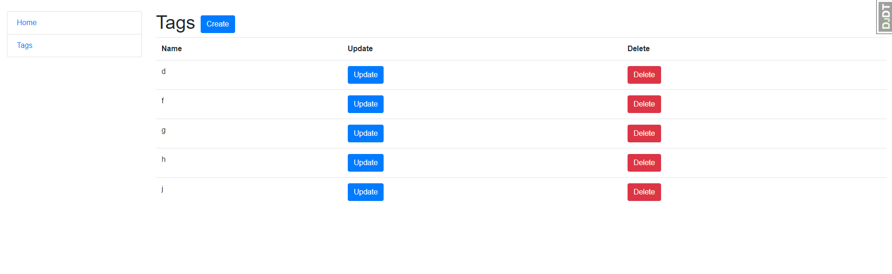

# Todo_list

Django project for managing tasks and tags in the Todo List

## Installation 

Python3 must be already installed

```shell
git clone https://github.com/Vanya2389/Todo_list
cd Todo_list
python3 -m venv venv
source venv/bin/activate  # on macOS
venv\Scripts\activate  # on Windows 
pip install -r requirements.txt
python manage.py migrate
python manage.py runserver #starts Django Server
```

## Secret key
In main folder you'll find a file .env_sample. In this file an example of SECRET_KEY is stored, required for the project.
You may need create a file .env and write here you secret key as in example.

## Features

* Managing tasks, tags directly from website interface

## Demo





